# HGSE Seminar Hub

Weekly email digest and subscribable calendar feeds for Helsinki GSE seminar events.

**Subscribe:** https://helsinki-gse-seminar-digest.vercel.app/

Every Monday at 08:00 Helsinki time, subscribers receive an email listing that week's seminars with one-click calendar buttons. You can also subscribe to **live-updating ICS calendar feeds** per seminar series — they show up in Google Calendar, Outlook, or Apple Calendar and update automatically.

## How it works

1. **Scraper** pulls events from [helsinkigse.fi/events](https://www.helsinkigse.fi/events) using BeautifulSoup
2. Events are stored in **Supabase** (Postgres)
3. **GitHub Actions** cron job runs every Monday — scrapes all events, sends digests, and refreshes calendar feeds
4. **Flask app on Vercel** serves the subscribe page, calendar feeds, and handles confirm/unsubscribe

## Architecture

```mermaid
flowchart LR
    User["👤 Subscriber"]
    Vercel["Vercel\n(Flask app)"]
    Supabase[("Supabase\n(Postgres)")]
    SendGrid["SendGrid"]
    GHA["GitHub Actions\n(weekly cron)"]
    GSE["helsinkigse.fi"]

    User -- "subscribe / confirm / unsubscribe\ncalendar feeds (.ics)" --> Vercel
    Vercel -- "read/write subscribers\nread events" --> Supabase
    Vercel -- "confirmation email" --> SendGrid
    GHA -- "scrape events" --> GSE
    GHA -- "store events, read subscribers" --> Supabase
    GHA -- "send digests" --> SendGrid
    SendGrid -- "emails" --> User
```



| Component | Technology | Cost |
|---|---|---|
| Weekly scrape + email | GitHub Actions cron | $0 |
| Subscribe/unsubscribe | Flask on Vercel | $0 |
| Database | Supabase (Postgres) | $0 |
| Transactional email | SendGrid | $0 |
| Calendar feeds | ICS feeds via Flask + `icalendar` | — |

## Project structure

```
src/scraper/
  scraper.py          # Scrapes event pages from helsinkigse.fi
  models.py           # Event and Subscriber dataclasses
  db.py               # Supabase CRUD (events, subscribers, sent_log)
  email_template.py   # HTML email rendering (inline CSS)
  email_sender.py     # SendGrid integration (digest + confirmation emails)
  calendar_links.py   # Google Calendar / Outlook URL generation
  tokens.py           # HMAC token generation for confirm/unsubscribe
  cli.py              # CLI entry point (scrape, store, send-test, send-digests)

api/
  index.py            # Flask app (Vercel entry point) + ICS calendar feed routes

templates/            # HTML pages (subscribe, success, confirmed, unsubscribed, error)

.github/workflows/
  weekly-digest.yml   # Monday cron job

migrations/
  001_initial.sql     # Database schema
```

## Calendar feeds

Subscribe to any seminar series and it appears in your calendar, updated every Monday:

| Series | Feed URL |
|---|---|
| Microeconomics | `/calendar/micro.ics` |
| Environmental Economics | `/calendar/environmental.ics` |
| Behavioral Economics | `/calendar/behavioral.ics` |
| Industrial Organization | `/calendar/io.ics` |
| Colloquium | `/calendar/colloquium.ics` |
| VATT | `/calendar/vatt.ics` |
| Trade, Regional & Urban | `/calendar/trade-urban.ics` |
| Labor & Public Economics | `/calendar/labor.ics` |

The subscribe page provides one-click buttons for Google Calendar (via `webcal://`) and Outlook (via `addfromweb`). For desktop Outlook, use the `.ics` link via **Add Calendar > Subscribe from Web**.

Event titles use the format `Series: Speaker`. The description includes the talk title, abstract, and link when available.

## Subscription flow

1. User enters email at the subscribe page
2. Confirmation email sent (double opt-in, GDPR compliant)
3. User clicks confirm link — subscription activated, first digest sent immediately
4. Every Monday: digest email with that week's events
5. One-click unsubscribe link in every email footer

## CLI usage

```bash
# Scrape all events and print JSON
scrape-events

# Scrape and store in Supabase
scrape-events --store

# Preview digest as local HTML file
scrape-events --preview-html digest.html

# Send test digest to a specific email
scrape-events --send-test you@example.com

# Send weekly digests to all active subscribers (production)
scrape-events --send-digests
```

## Environment variables

Set in `.env` for local dev, in Vercel dashboard for production, and as GitHub Actions secrets for the cron job:

| Variable | Description |
|---|---|
| `SUPABASE_URL` | Supabase project URL |
| `SUPABASE_KEY` | Supabase service role key |
| `SENDGRID_API_KEY` | SendGrid API key (Mail Send permission) |
| `EMAIL_FROM` | Verified sender email address |
| `SECRET_KEY` | HMAC key for signing confirm/unsubscribe tokens |
| `APP_BASE_URL` | Production URL (https://helsinki-gse-seminar-digest.vercel.app) |

## Email digest features

- Category badges per event (e.g., "Environmental Economics", "PhD Seminar")
- Google Calendar, Outlook, and .ics download buttons per event
- Per-subscriber unsubscribe links with HMAC tokens
- Digest scoped to current week (Monday–Sunday)
- First digest sent immediately on confirmation

## Disclaimer

This is a personal hobby project by [Ramin Izadi](https://github.com/raminizadi) and is not affiliated with Helsinki GSE. Found a bug or have a feature request? [Open an issue](https://github.com/raminizadi/helsinki-gse-seminar-digest/issues).

## Local development

```bash
# Install dependencies
pip install -e .

# Run Flask app locally
python -c "from api.index import app; app.run(debug=True)"
# → http://localhost:5000
```
